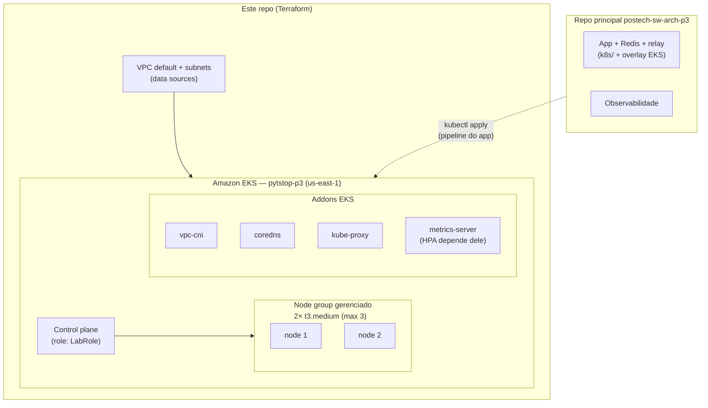

# postech-sw-arch-p3-infra-k8s

Infraestrutura Kubernetes da fase 3 do Tech Challenge (PytStop): provisionamento
do cluster **Amazon EKS** via **Terraform**, em repositório dedicado com CI/CD —
conforme exigido pelo challenge (RNF-024/RNF-025) e decidido nos
[ADR-026](https://github.com/fiap-postech-sw-architecture/postech-sw-arch-p3/blob/main/docs/arquitetura/adr/fase3/026-cloud-alvo-aws-academy.md)
e
[ADR-030](https://github.com/fiap-postech-sw-architecture/postech-sw-arch-p3/blob/main/docs/arquitetura/adr/fase3/030-cluster-kubernetes-eks.md)
do repo principal.

**Escopo deste repo: só o cluster e seus addons de base.** O deploy da
aplicação (manifests `k8s/`, overlay EKS, observabilidade) é responsabilidade
do repo principal [`postech-sw-arch-p3`](https://github.com/fiap-postech-sw-architecture/postech-sw-arch-p3).
O **kind continua o alvo local** de desenvolvimento e demo sem custo.

## Tecnologias

- **Terraform** >= 1.9, provider `hashicorp/aws ~> 5.0`
- **Amazon EKS** — Kubernetes gerenciado, versão 1.34 (variável)
- **Node group gerenciado** — 2× `t3.medium`, disco 20 GB, scaling 2/2/3
- **AWS Academy Learner Lab** — conta institucional FIAP, região `us-east-1`

## Arquitetura



## Restrições do AWS Academy (moldam tudo aqui)

- **IAM travado**: o Terraform **não cria** roles/policies. Cluster role e node
  role usam a `LabRole` pré-existente, via `data.aws_iam_role.lab_role`.
- **Sessões de ~4h com credenciais rotativas**: cada _Start Lab_ emite novas
  credenciais — re-gravar o profile `academy` (e os secrets de CI) a cada
  sessão. Runbook: `aws-academy-setup.md` no repo `postech-sw-arch-p3-docs`.
- **State local, sem backend remoto**: a vida útil do cluster é a janela de uma
  sessão de lab; backend S3 seria complexidade sem benefício (ADR-026).

## Execução local (sem AWS)

```bash
make gate    # fmt-check + init -backend=false + validate — mesmo check do CI
make fmt     # formata os .tf in-place
```

## Deploy (exige sessão do Academy ativa)

Ordem multi-repo: `infra-db → infra-k8s → app (repo p3) → lambda/gateway` —
o gateway precisa da URL pública do app (o ADR-033 receberá adendo).

1. **Start Lab** no AWS Academy e copie as credenciais para o profile
   `academy` do `~/.aws/credentials` (runbook).
2. Provisione e conecte:

```bash
make plan          # revisa o que será criado
make apply         # cria o cluster (~10-15 min)
make kubeconfig    # aws eks update-kubeconfig --name pytstop-p3 --profile academy --region us-east-1
kubectl get nodes  # 2 nodes Ready
```

3. O deploy da aplicação é feito pelo repo principal (overlay EKS).

## Aviso de budget — destroy pós-demo é OBRIGATÓRIO

O budget do Learner Lab é pequeno e o esgotamento **encerra a conta**
definitivamente. Control plane do EKS + 2 nodes consomem crédito por hora:

```bash
make destroy   # sempre, ao fim de cada demo/validação
```

O _End Lab_ pausa EC2, mas **não** zera o custo do control plane — destrua.

## CI/CD

- `ci.yml` — `fmt-check` + `validate` em todo push/PR (não toca a AWS).
- `cd.yml` — `homolog` → `terraform plan`; `main` → `terraform apply`.
  Secrets `AWS_ACCESS_KEY_ID` / `AWS_SECRET_ACCESS_KEY` / `AWS_SESSION_TOKEN`
  re-gravados a cada sessão do lab (ver comentários no workflow).
- Push em `homolog` roda `terraform plan` (estágio de homologação de infra);
  apply automático só na `main`: com um único Learner Lab e budget mínimo,
  ambiente homolog duplicado de infra é inviável (adendo do ADR-033).

## Status e pendências

- [ ] **Conta AWS Academy ainda não ativada** — nenhum `plan`/`apply` real foi
      executado; `fmt` + `validate` estão verdes localmente.
- [ ] **Cota do GitHub Actions da organização esgotada** — os workflows
      documentam o fluxo exigido; a operação real segue o caminho local
      equivalente do runbook (`make plan` / `make apply`).
- [ ] **CD apply com state local** — um apply no runner efêmero perde o state;
      enquanto o backend for local, o apply autoritativo é o da máquina do dev.
      Reavaliar backend remoto só se o fluxo via Actions virar o caminho real.
- [ ] **metrics-server como addon EKS** — provisionado como community addon
      (`addons.tf`); se a versão do cluster não o oferecer, usar o fallback
      via `kubectl` documentado no próprio arquivo (o HPA do repo principal
      depende dele).
- [ ] **Overlay EKS no repo principal** — storage class, exposição e
      `ENVIRONMENT` do alvo cloud vivem no `postech-sw-arch-p3` (ADR-030).
- [ ] **Hipótese não validada: trust policy da LabRole** — assume-se que ela
      permite `eks.amazonaws.com`; só confirmável no primeiro `plan`/`apply`
      com credenciais do Academy.

Dockerfile/Swagger: n/a — repo 100% Terraform, sem artefato conteinerizável
nem API própria.
