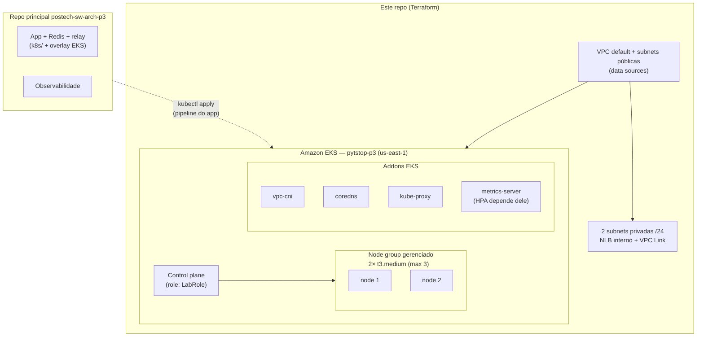

# postech-sw-arch-p3-infra-k8s

Infraestrutura Kubernetes da fase 3 do Tech Challenge (PytStop): provisionamento
do cluster **Amazon EKS** via **Terraform**, em repositório dedicado com CI/CD —
conforme exigido pelo challenge (RNF-024/RNF-025) e decidido nos
[ADR-026](https://github.com/fiap-postech-sw-architecture/postech-sw-arch-p3/blob/main/docs/arquitetura/adr/fase3/026-cloud-alvo-aws-academy.md)
e
[ADR-030](https://github.com/fiap-postech-sw-architecture/postech-sw-arch-p3/blob/main/docs/arquitetura/adr/fase3/030-cluster-kubernetes-eks.md)
do repo principal.

**Escopo deste repo: cluster, rede privada e addons de base.** O deploy da
aplicação (manifests `k8s/`, overlay EKS, observabilidade) é responsabilidade
do repo principal [`postech-sw-arch-p3`](https://github.com/fiap-postech-sw-architecture/postech-sw-arch-p3).
O **kind continua o alvo local** de desenvolvimento e demo sem custo.

## Tecnologias

- **Terraform** >= 1.10, provider `hashicorp/aws ~> 5.0`
- **Amazon EKS** — Kubernetes gerenciado, versão 1.34 (variável)
- **Node group gerenciado** — 2× `t3.medium`, disco 20 GB, scaling 2/2/3
- **AWS Academy Learner Lab** — conta institucional FIAP, região `us-east-1`
- **Rede privada** — duas subnets `/24`, sem rota default ou NAT Gateway

## Arquitetura


```mermaid
flowchart TB
    subgraph repo_infra["Este repo (Terraform)"]
        subgraph eks["Amazon EKS — pytstop-p3 (us-east-1)"]
            cp["Control plane<br/>(role: LabRole)"]
            subgraph ng["Node group gerenciado<br/>2× t3.medium (max 3)"]
                n1["node 1"]
                n2["node 2"]
            end
            subgraph addons["Addons EKS"]
                cni["vpc-cni"]
                dns["coredns"]
                kp["kube-proxy"]
                ms["metrics-server<br/>(HPA depende dele)"]
            end
        end
        vpc["VPC default + subnets públicas<br/>(data sources)"]
        private["2 subnets privadas /24<br/>NLB interno + VPC Link"]
    end

    subgraph repo_app["Repo principal postech-sw-arch-p3"]
        app["App + Redis + relay<br/>(k8s/ + overlay EKS)"]
        mon["Observabilidade"]
    end

    vpc --> eks
    vpc --> private
    cp --> ng
    repo_app -. "kubectl apply<br/>(pipeline do app)" .-> eks
```

## Restrições do AWS Academy (moldam tudo aqui)

- **IAM travado**: o Terraform **não cria** roles/policies. Cluster role e node
  role usam a `LabRole` pré-existente. O ARN é formado com o account ID de
  `aws_caller_identity`, sem a chamada `iam:GetRole` negada pelo Learner Lab.
- **Sessões de ~4h com credenciais rotativas**: cada _Start Lab_ emite novas
  credenciais na cadeia padrão (e os secrets de CI) a cada sessão. Runbook:
  `aws-academy-setup.md` no repo `postech-sw-arch-p3-docs`.
- **State remoto sem DynamoDB**: backend S3 no bucket
  `pytstop-terraform-state-924563550535`, chave `eks/terraform.tfstate`, com
  versionamento e lock nativo (`use_lockfile`).
- **Sem NAT Gateway**: `172.31.240.0/24` em `us-east-1a` e
  `172.31.241.0/24` em `us-east-1b` usam uma route table sem rota default.
- **Nodes nas subnets públicas originais**: o filtro `default-for-az=true`
  impede que EKS e node group redescubram as subnets privadas da integração.
- **Descoberta privada**: as subnets usam as tags
  `kubernetes.io/role/internal-elb=1` e
  `kubernetes.io/cluster/pytstop-p3=shared`; elas são exclusivas do NLB
  interno e do VPC Link desta integração.

## Execução local (sem AWS)

```bash
make gate    # fmt-check + validate + terraform test — mesmo check do CI
make fmt     # formata os .tf in-place
```

## Deploy (exige sessão do Academy ativa)

Ordem multi-repo: `infra-db → infra-k8s → app (repo p3) → lambda/gateway`.
O app cria o NLB interno; o último passo recebe o ARN do listener e cria o
VPC Link.

1. **Start Lab** no AWS Academy e configure as credenciais na cadeia padrão da
   AWS CLI (runbook).
2. Provisione e conecte:

```bash
make plan          # revisa o que será criado
make apply         # cria o cluster (~10-15 min)
make kubeconfig    # aws eks update-kubeconfig --name pytstop-p3 --region us-east-1
kubectl get nodes  # 2 nodes Ready
terraform output private_subnet_ids
```

3. O deploy da aplicação é feito pelo repo principal (overlay EKS).

Os comandos locais e o CD compartilham o mesmo state remoto. Não inicie
`plan`, `apply` ou `destroy` local enquanto o workflow de CD estiver rodando.

## Aviso de budget

O budget do Learner Lab é pequeno e o esgotamento **encerra a conta**
definitivamente. Control plane do EKS + 2 nodes consomem crédito por hora:

```bash
make destroy   # ao final da janela de preparação e gravação
```

O _End Lab_ pausa EC2, mas **não** zera o custo do control plane. A
infraestrutura pode permanecer durante a preparação e gravação, por no máximo
sete dias; depois disso, destrua EKS, NLB e VPC Link na ordem documentada.

## CI/CD

- `ci.yml` — `fmt-check` + `validate` + `terraform test` em todo push/PR
  (não toca a AWS).
- `cd.yml` — `homolog` → `terraform plan`; `main` → `terraform apply`.
  As branches são serializadas sobre o único state S3 com lock nativo.
  Secrets `AWS_ACCESS_KEY_ID` / `AWS_SECRET_ACCESS_KEY` / `AWS_SESSION_TOKEN`
  re-gravados a cada sessão do lab (ver comentários no workflow).
- Push em `homolog` roda `terraform plan` (estágio de homologação de infra);
  apply automático só na `main`: com um único Learner Lab e budget mínimo,
  ambiente homolog duplicado de infra é inviável (adendo do ADR-033).

## Status e pendências

- [x] **Provisionamento AWS** — `terraform apply` automático na `main` em
      07/09/2026 ([run 34178105568](https://github.com/fiap-postech-sw-architecture/postech-sw-arch-p3-infra-k8s/actions/runs/34178105568)):
      EKS 1.34 `ACTIVE`, node group `ACTIVE` com 2 nodes, subnets privadas
      para o NLB/VPC Link; state remoto no S3 com lock nativo.
- [x] **metrics-server como addon EKS** — provisionado como community addon
      (`addons.tf`) e validado no cluster real (HPA do repo principal ativo).
- [x] **Hipótese da trust policy da LabRole** — confirmada no primeiro `apply`:
      a role assume `eks.amazonaws.com` e serve ao cluster e ao node group.
- [x] **Overlay EKS no repo principal** — storage class, exposição por NLB
      interno e `ENVIRONMENT` do alvo cloud vivem no `postech-sw-arch-p3`
      (ADR-030); deploy pelo `cd.yml` de lá.
- [ ] **Desmontagem** — EKS e NLB não têm pausa sem cobrança: `terraform destroy`
      na ordem inversa (lambda → app/NLB → este repo → RDS) e End Lab ao final
      da gravação, com sessão ativa (`aws-academy-setup.md` no `p3-docs`).

Dockerfile/Swagger: n/a — repo 100% Terraform, sem artefato conteinerizável
nem API própria.
